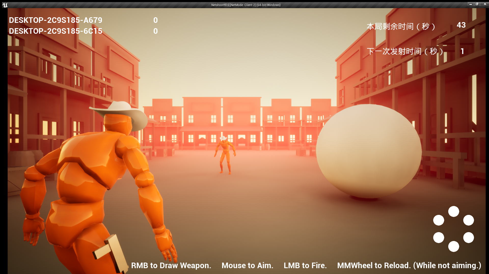
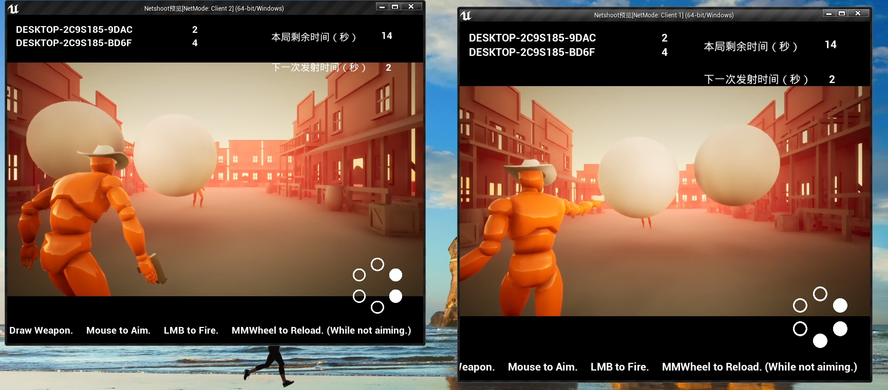

# UE_HW2

## 第二次作业

### 作业内容：
在提供案例的基础上添加会飞的物体，命中加分
设置游戏时间为两分钟，在时间结束后通过UI界面展示分数表
### 具体实现：
- 添加飞盘作为会飞的物体（抛物线运动），在所有客户端可见，飞盘在固定位置每隔3秒发射一次，添加碰撞检测，落地消失，防止内存爆炸（为了方便命中设置为球形，增大体积）。

- 添加倒计时UI功能：显示当前对局剩余时间以及下一次轮盘发射时间（右上角）。

  

- 命中飞盘，飞盘消失同时发射者得分加一，同时将得分信息复制到所有客户端保持分数信息一致。

  

- 对局剩余时间为0，弹出结算UI显示用户名和得分，获胜者名字前添加winner字样，并对背景模糊化处理。

  

### 演示视频链接
分别演示了飞盘静止和运动两种情况的效果
链接：https://pan.baidu.com/s/1VrRS0VR4_FzqfaJk8n5ktA 
提取码：1024